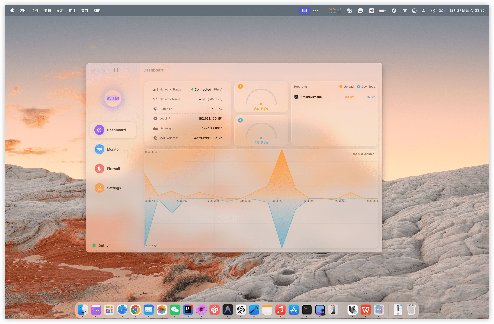
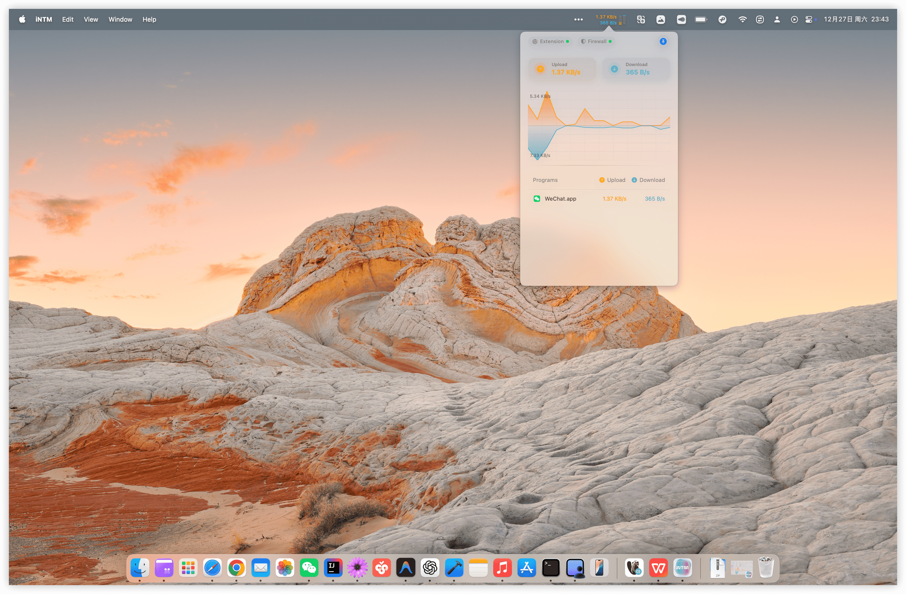
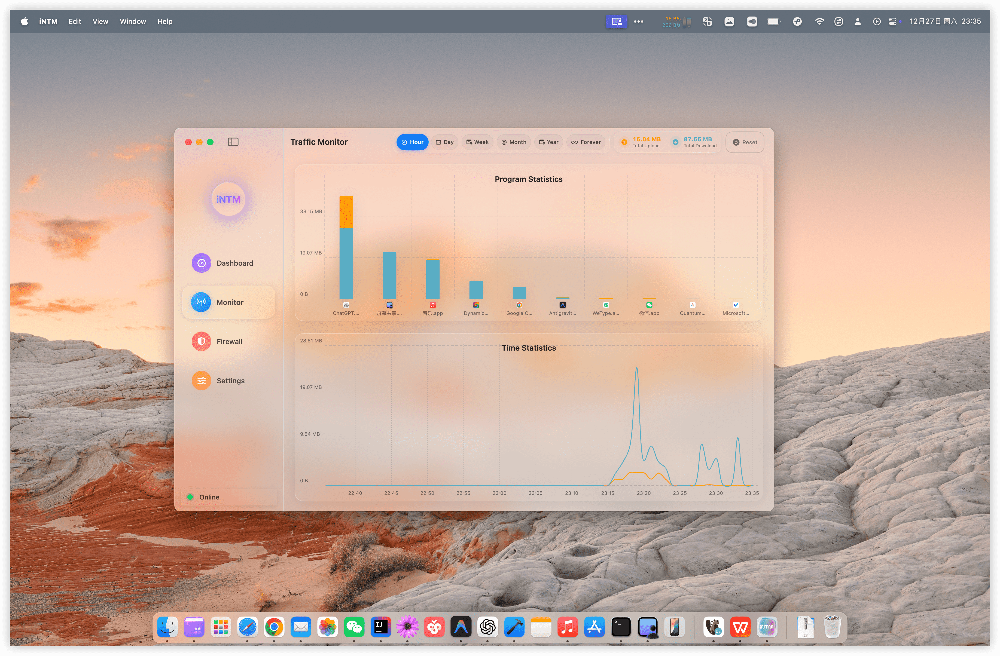
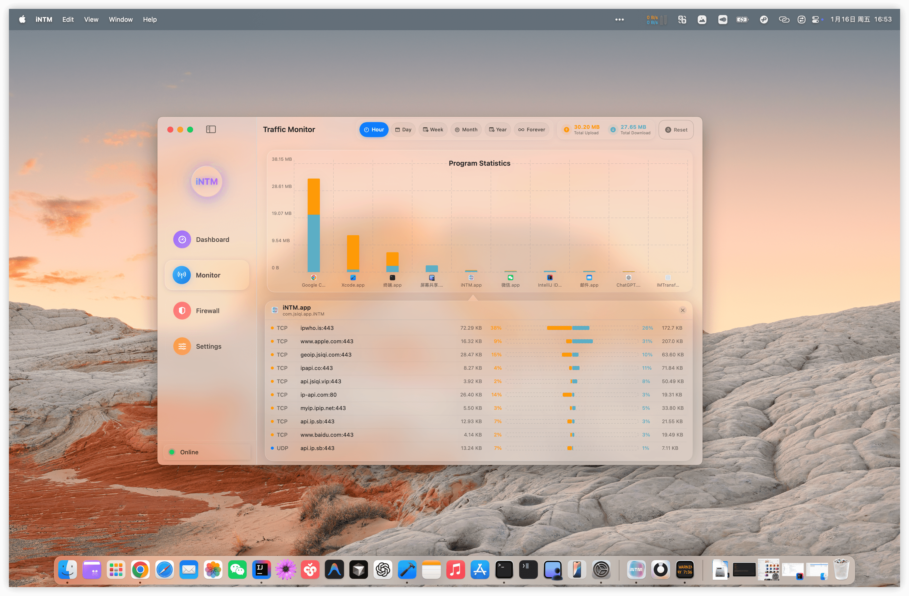
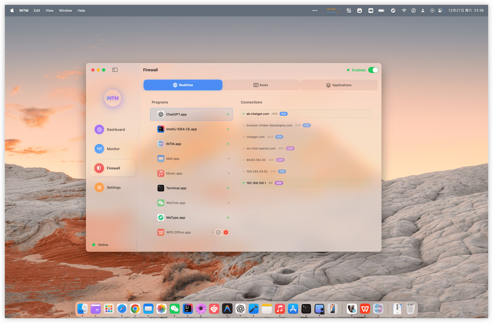
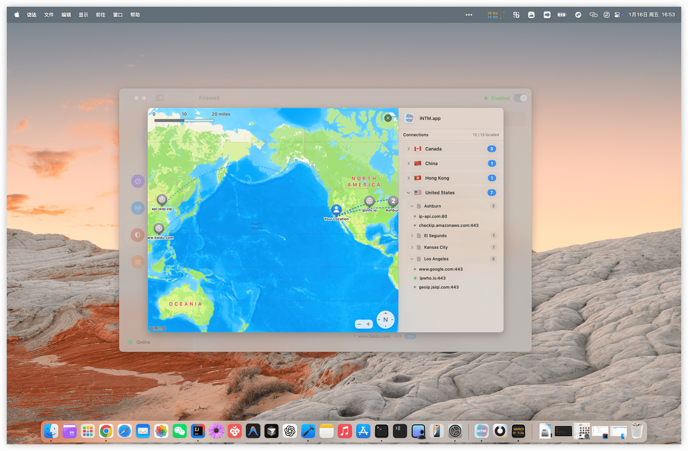

# iNTM

**Intelligent Network Traffic Monitor · Built for macOS**

[简体中文](README.zh-CN.md) | English

---

## ✨ Core Features

### 📊 Real-time Traffic Monitoring
- **System-Level Statistics**: Accurately capture all network activities
- **Per-Application Analysis**: Track upload/download speed and traffic for each app
- **Menu Bar Display**: Real-time network speed in status bar
- **Historical Data Tracking**: Complete traffic history and trend analysis
- **Smart Caching**: Optimized LRU cache for performance

### 🔍 Connection Details
- **Live Connection List**: View all active network connections
- **Process Identification**: Automatically identify the app for each connection
- **Domain Resolution**: Smart DNS resolution to display domains instead of IPs
- **Connection Info**: Protocol type, ports, and traffic statistics at a glance

### 🛡️ Firewall Rules
- **Application-Level Firewall**: Fine-grained control based on apps, domains, IPs, and ports
- **Rule Group Management**: Flexible rule grouping and priority settings
- **Real-time Decisions**: Millisecond-level firewall rule evaluation

### 📈 Traffic Analysis
- **Data Persistence**: High-performance storage based on GRDB/SQLite
- **Smart Aggregation**: Automatic aggregation by application and time dimensions
- **Visualization**: Clear charts showing traffic trends
- **Data Export**: Export traffic data for analysis

### 🎨 Native macOS Experience
- **SwiftUI Interface**: Fully native macOS design
- **Menu Bar Integration**: Convenient quick access from status bar
- **Dark Mode Support**: Automatic adaptation to system appearance
- **High Performance**: System-level monitoring based on NetworkExtension

---

## 📸 Screenshots

<table>
  <tr>
    <td colspan="2" align="center"><b>Dashboard - Real-time Traffic Monitoring</b></td>
  </tr>
  <tr>
    <td width="50%"></td>
    <td width="50%"></td>
  </tr>

  <tr>
    <td colspan="2" align="center"><b>Traffic Statistics & Live Connections</b></td>
  </tr>
  <tr>
    <td width="50%"></td>
    <td width="50%"></td>
  </tr>

  <tr>
    <td colspan="2" align="center"><b>Firewall Rules & Management</b></td>
  </tr>
  <tr>
    <td width="50%"></td>
    <td width="50%"></td>
  </tr>
</table>

---

## 📦 Download & Installation

### System Requirements
- macOS 15.0 or later (Sequoia and above)
- Apple Silicon (M1/M2/M3/M4...) recommended

### Installation Steps

1. **Download the App**
   - [Download from Official Website](https://intm.jsiqi.vip/)
   - [Download on the App Store](https://apps.apple.com/cn/app/intm/id6758553441)

2. **Install the App**
   - Mount the downloaded DMG file
   - Drag iNTM to Applications folder
   - Launch the app

3. **Grant Permissions**
   - The app will request network monitoring permissions
   - Approve the system extension in "System Settings → Privacy & Security"

---

## 📄 License

This project is **proprietary and closed-source software**. All rights reserved.

### Copyright Notice

Copyright © 2025-2026 iNTM. All rights reserved.

This software and its documentation are protected by copyright law and international treaties. Unauthorized reproduction or distribution of this software, or any portion of it, may result in severe civil and criminal penalties, and will be prosecuted to the maximum extent possible under the law.

### Third-Party Components

iNTM uses the following open-source projects:

- [GRDB.swift](https://github.com/groue/GRDB.swift) - SQLite toolkit (MIT)
- [Factory](https://github.com/hmlongco/Factory) - Dependency injection framework (MIT)
- [Sparkle](https://github.com/sparkle-project/Sparkle) - Auto-update framework (MIT)
- [SwiftUI-Introspect](https://github.com/siteline/SwiftUI-Introspect) - SwiftUI debugging tools (MIT)
- [ZIPFoundation](https://github.com/weichsel/ZIPFoundation) - ZIP archive tools (MIT)
- [swift-log](https://github.com/apple/swift-log) - Logging framework (Apache 2.0)
- [swift-collections](https://github.com/apple/swift-collections) - Advanced collections (Apache 2.0)

See [THIRD_PARTY_LICENSES.md](THIRD_PARTY_LICENSES.md) for details.

---

## 🤝 Feedback & Suggestions

We welcome feedback and feature suggestions!

- **Bug Reports**: [GitHub Issues](https://github.com/dcncy/iNTM/issues)
- **Feature Requests**: [GitHub Discussions](https://github.com/dcncy/iNTM/discussions)
- **Documentation**: See [CONTRIBUTING.md](CONTRIBUTING.md) for guidelines

**Note**: iNTM is closed-source software. We do not accept code contributions, but we highly value user feedback and feature suggestions.

---

## 📮 Contact

- **Official Website**: [https://intm.jsiqi.vip/](https://intm.jsiqi.vip/)
- **Issues**: [GitHub Issues](https://github.com/dcncy/iNTM/issues)
- **Discussions**: [GitHub Discussions](https://github.com/dcncy/iNTM/discussions)

---

## ⚠️ Disclaimer

This software is provided "as is" without warranty of any kind, express or implied. In no event shall the authors or copyright holders be liable for any claim, damages, or other liability.

---

**Built with ❤️ and Swift**

Copyright © 2025-2026 iNTM. All rights reserved.

