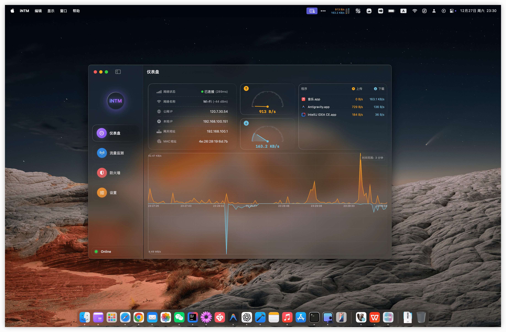
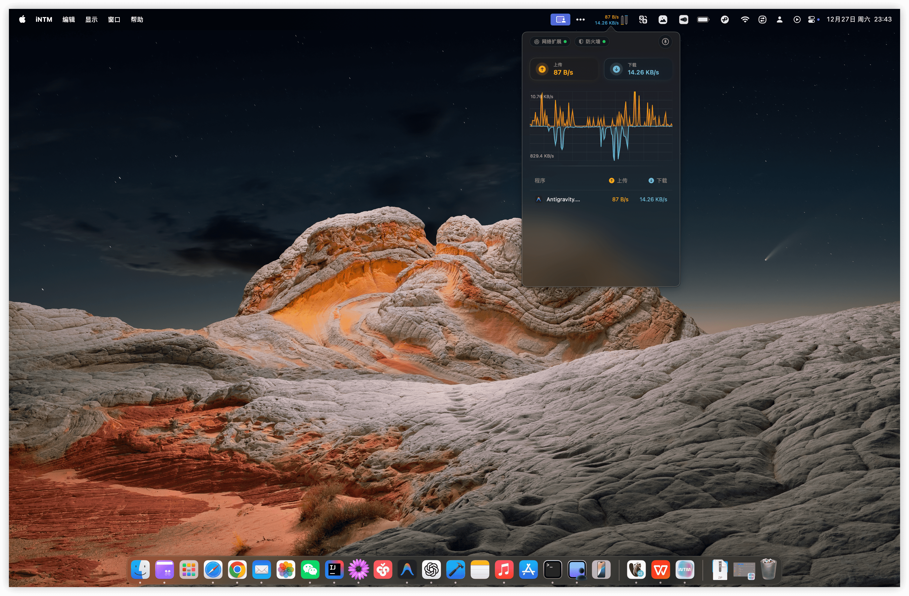
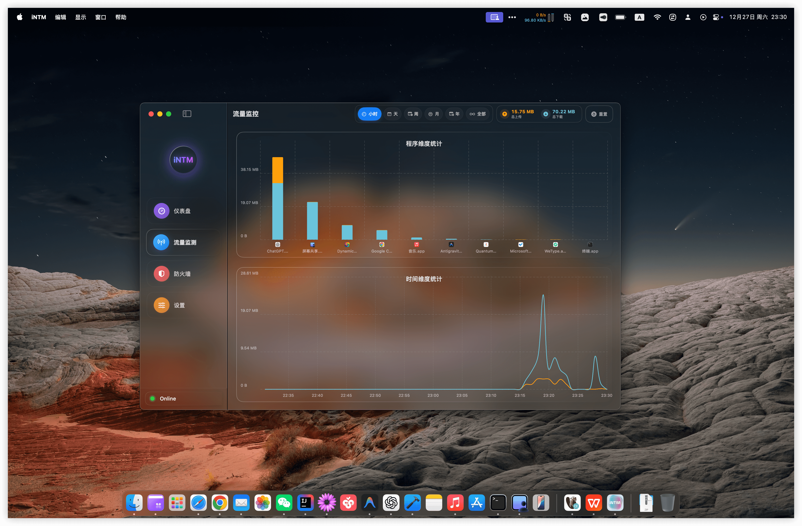
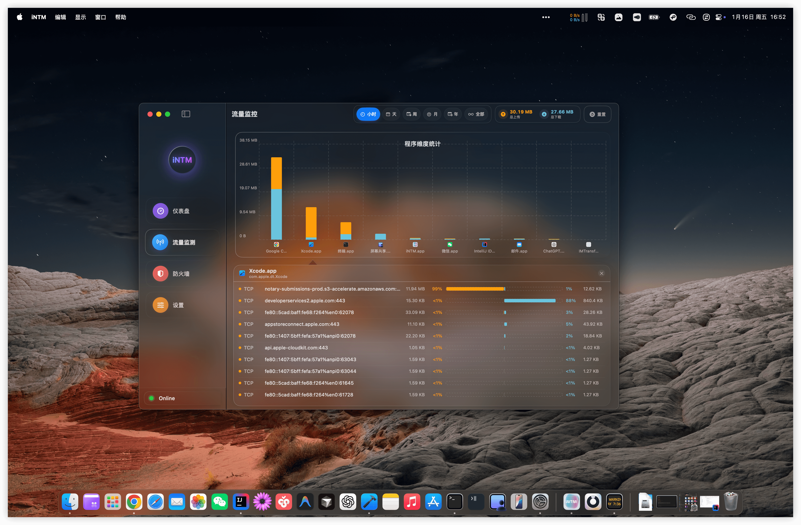
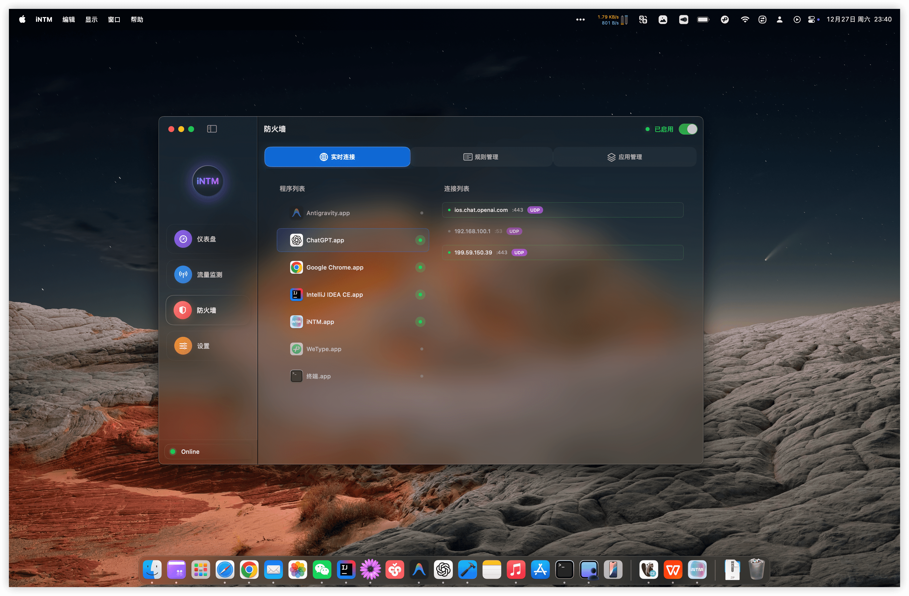
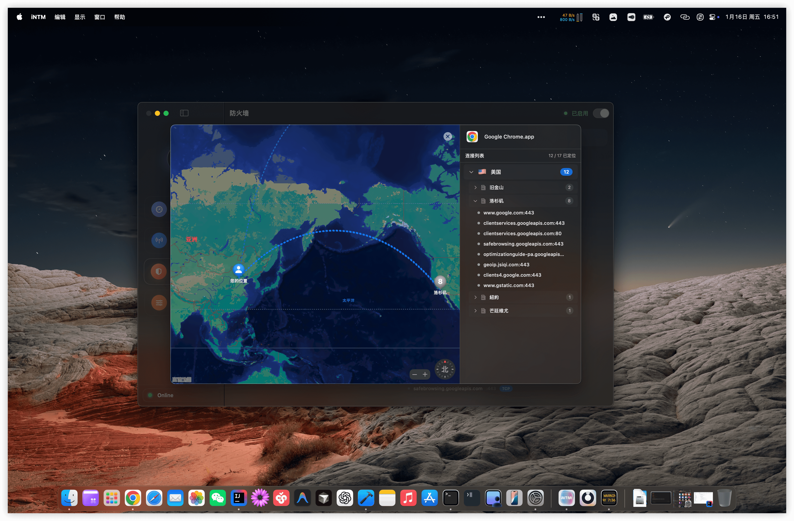

# iNTM

**智能网络流量监控工具 · 为 macOS 打造**

简体中文 | [English](README.md)

---

## ✨ 核心功能

### 📊 实时流量监控
- **系统级流量统计**：精确捕获系统所有网络活动
- **应用级别分析**：查看每个应用的实时上传/下载速度和累计流量
- **状态栏实时显示**：在菜单栏实时显示当前网络速度，一目了然
- **历史数据追踪**：完整记录流量历史，支持趋势分析和数据导出
- **智能缓存优化**：采用 LRU 缓存策略

### 🔍 连接详情
- **实时连接列表**：查看所有活跃的网络连接和会话
- **进程精准识别**：自动识别每个连接对应的应用程序
- **智能域名解析**：支持反向 DNS 查询，支持显示域名
- **详细连接信息**：协议类型、本地/远程端口、流量统计应有尽有

### 🛡️ 防火墙规则
- **应用级防火墙**：基于应用、域名、IP、端口的精细化访问控制
- **灵活规则管理**：支持规则分组、优先级设置和批量操作
- **毫秒级响应**：实时评估和应用防火墙规则，保护网络安全

### 📈 流量统计分析
- **高性能存储**：基于 GRDB/SQLite 的数据持久化方案
- **智能数据聚合**：自动按应用、时间维度聚合统计数据
- **可视化图表**：清晰直观的图表展示流量趋势和分布
- **数据导出功能**：支持导出流量数据用于深度分析

### 🎨 原生 macOS 体验
- **SwiftUI 原生界面**：完全采用 macOS 原生设计语言
- **菜单栏深度集成**：便捷的状态栏快捷访问和控制
- **深色模式支持**：完美适配系统浅色/深色外观
- **系统级监控架构**：基于 NetworkExtension 框架的专业级监控
- **极致性能优化**：精心优化的内存管理，流畅运行不卡顿

---

## 📸 界面预览

<table>
  <tr>
    <td colspan="2" align="center"><b>流量监控</b></td>
  </tr>
  <tr>
    <td width="50%"></td>
    <td width="50%"></td>
  </tr>

  <tr>
    <td colspan="2" align="center"><b>数据统计与实时连接</b></td>
  </tr>
  <tr>
    <td width="50%"></td>
    <td width="50%"></td>
  </tr>

  <tr>
    <td colspan="2" align="center"><b>防火墙规则与管理</b></td>
  </tr>
  <tr>
    <td width="50%"></td>
    <td width="50%"></td>
  </tr>
</table>

---

## 📦 下载与安装

### 系统要求
- macOS 14.0 或更高版本（Sonoma 及以上）
- 推荐使用 Apple Silicon (M1/M2/M3/M4...)

### 下载安装

1. **下载应用**
   - [从官网下载](https://intm.jsiqi.vip/)

2. **安装应用**
   - 打开下载的 DMG 文件
   - 将 iNTM.app 拖入"应用程序"文件夹
   - 启动应用

3. **授予必要权限**
   - 应用会请求网络监控权限
   - 前往"系统设置 → 隐私与安全性"批准系统扩展

---

## 📄 开源许可

本项目为**专有闭源软件**，保留所有权利。

### 版权声明

Copyright © 2025-2026 iNTM. 保留所有权利。

本软件及其文档受版权法和国际条约保护。未经授权复制或分发本软件或其任何部分，可能导致严重的民事和刑事处罚，并将在法律允许的最大范围内予以起诉。

### 第三方开源组件

iNTM 站在巨人的肩膀上，感谢以下优秀的开源项目：

- [GRDB.swift](https://github.com/groue/GRDB.swift) - Swift 的 SQLite 工具包 (MIT)
- [Factory](https://github.com/hmlongco/Factory) - Swift 依赖注入框架 (MIT)
- [Sparkle](https://github.com/sparkle-project/Sparkle) - macOS 自动更新框架 (MIT)
- [SwiftUI-Introspect](https://github.com/siteline/SwiftUI-Introspect) - SwiftUI 视图调试工具 (MIT)
- [ZIPFoundation](https://github.com/weichsel/ZIPFoundation) - Swift ZIP 归档库 (MIT)
- [swift-log](https://github.com/apple/swift-log) - Apple 官方日志 API (Apache 2.0)
- [swift-collections](https://github.com/apple/swift-collections) - Apple 高级集合类型 (Apache 2.0)

详细的第三方许可证信息请查看 [THIRD_PARTY_LICENSES.md](THIRD_PARTY_LICENSES.md)。

---

## 🤝 反馈与建议

欢迎提交问题报告和功能建议！

- **问题反馈**：[GitHub Issues](https://github.com/yourusername/iNTM/issues)
- **功能建议**：[GitHub Discussions](https://github.com/yourusername/iNTM/discussions)
- **反馈指南**：详见 [CONTRIBUTING.md](CONTRIBUTING.md)

**注意**：iNTM 是闭源软件，我们目前不接受代码贡献，但非常重视用户的反馈和功能建议。

---

## 📮 联系方式

- **官方网站**：[https://intm.jsiqi.vip/](https://intm.jsiqi.vip/)
- **问题反馈**：[GitHub Issues](https://github.com/yourusername/iNTM/issues)
- **功能讨论**：[GitHub Discussions](https://github.com/yourusername/iNTM/discussions)

---

## ❓ 常见问题

### Q: 为什么需要授予系统扩展权限？
A: iNTM 使用 macOS 的 NetworkExtension 框架进行系统级网络监控，这需要系统扩展权限。这是 macOS 安全机制的要求，确保只有经过用户授权的应用才能访问网络流量。

### Q: 应用会收集我的数据吗？
A: 不会。iNTM 完全在本地运行，所有流量数据都存储在你的 Mac 上，不会上传到任何服务器。我们重视你的隐私。

### Q: 内存占用高怎么办？
A: iNTM 经过深度优化，正常情况下内存占用应小于 50MB。如果遇到内存占用异常，请尝试重启应用或提交 Issue。

### Q: 支持 macOS Ventura 或更早版本吗？
A: 目前仅支持 macOS 14.0 (Sonoma) 及以上版本。如果有足够的需求，我们会考虑支持更早的系统版本。

---

## ⚠️ 免责声明

本软件按"原样"提供，不提供任何明示或暗示的保证。在任何情况下，作者或版权所有者均不对任何索赔、损害或其他责任负责。使用本软件即表示你同意自行承担所有风险。

本软件仅供合法用途，请勿用于任何非法活动。使用者应遵守所在地区的法律法规。

---

**用 ❤️ 和 Swift 精心打造**

Copyright © 2025-2026 iNTM. 保留所有权利。

